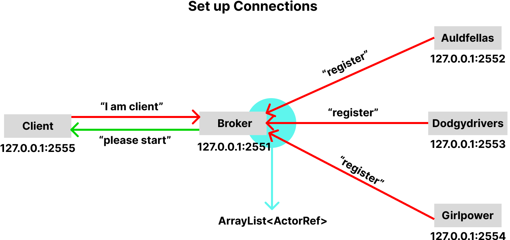
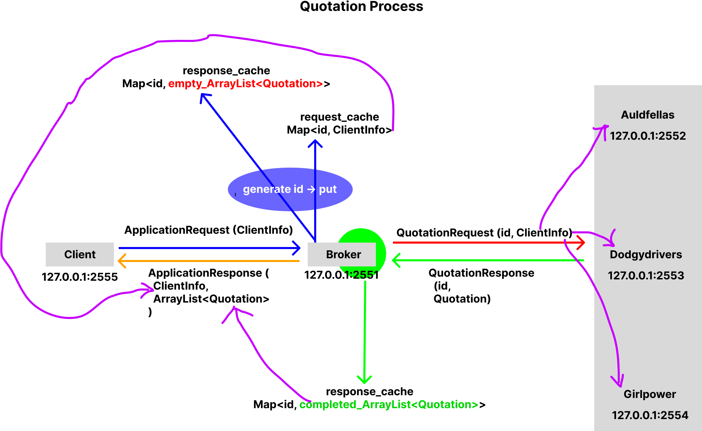
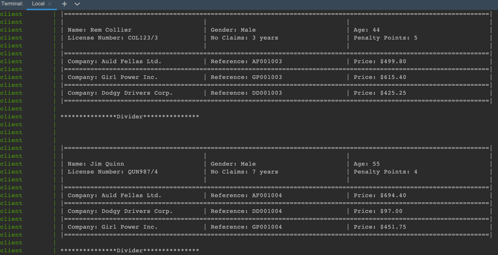

# Quoco-Akka
## Architecture and Implementation
### Connections between components
- For three services, they will send a String message "register" to broker, tell the broker that "I want to be registered", once the broker received this message, it will add the ActorRef of the service to a list.
- For client, it will send a String message "I am client" to broker, once the broker received this message, it will send a String message "please start" back to client, which tells the client to start sending requests.

### How quotation process works?
- Client sends ApplicationRequest to Broker
- Broker generates an id for each request, associates id with ClientInfo, stores this in 'request_cache'
- Broker associates id with an empty ArrayList<Quotation>, stores this in 'response_cache'
- Broker forms QuotationRequest object, sends it to three services
- Services process received QuotationRequest, send QuotationResponse to Broker
- By matching id, Broker fills values in 'response_cache' using data from QuotationResponse
- Broker forms ApplicationResponse using 'request_cache' and 'response_cache', sends ApplicationResponse to Client
- Client receives ApplicationResponse from Broker

## How to run this project?
As I've dockerized each component except 'core' module, so we can run it using docker commands:
First cd to root folder, then type:
```
docker compose up --build
```
Then you will see this in the console:

