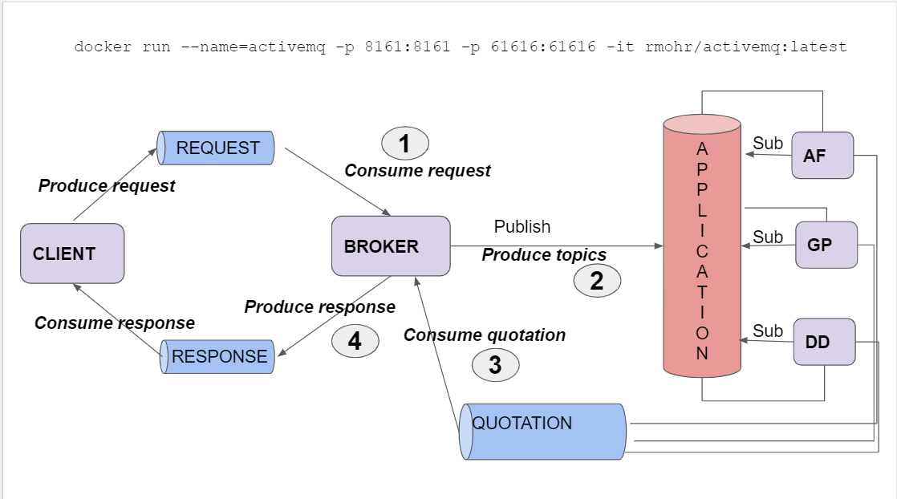
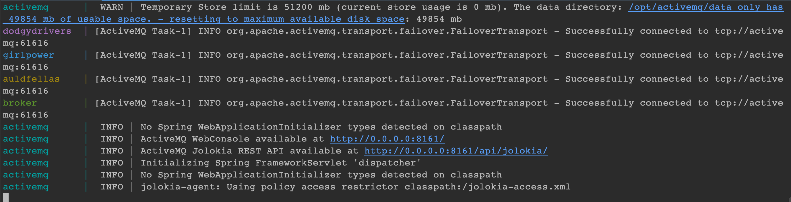
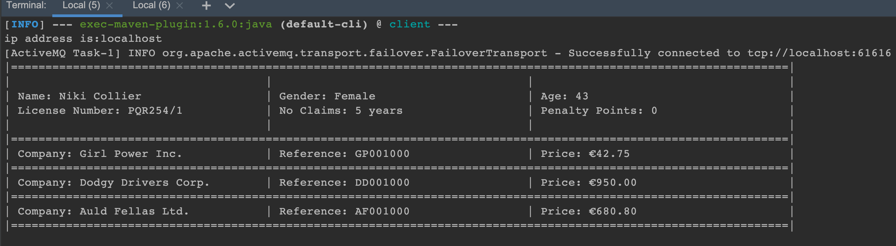

# Implementation
I had implemented all the tasks in this practical.
The code follows the diagram from class:
  
There are three queues which are REQUEST, QUOTATION and RESPONSE.
There is one topic APPLICATIONS.

# How to run
As the project has already been built with docker (except client module), so we need two terminals to run it.

- Open the first terminal, type:  
```docker compose up --build```  
And you will see this in console:
  
- Open another terminal, type:  
```mvn exec:java -pl client```  
As I set a sleep time about 10 seconds, so each 10 seconds, there will be one client along with its quotations printed in the console:

