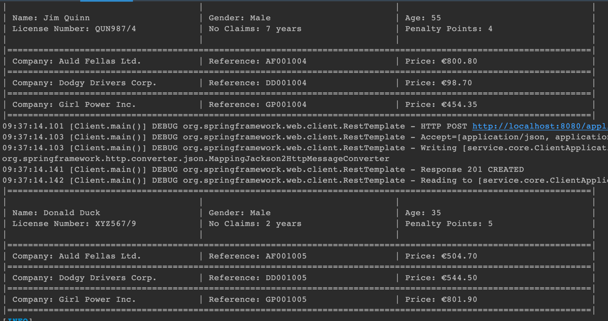

# Quoco-REST
## Architecture of my project

## How to run?
I built every component into docker except core and client, so we can open the terminal, cd to the root folder, and run:
```
docker compose up --build
```
then we would see spring boot apps start running:

open another terminal, type:
```
mvn exec:java -pl client
```
all information would be printed out in the console:
